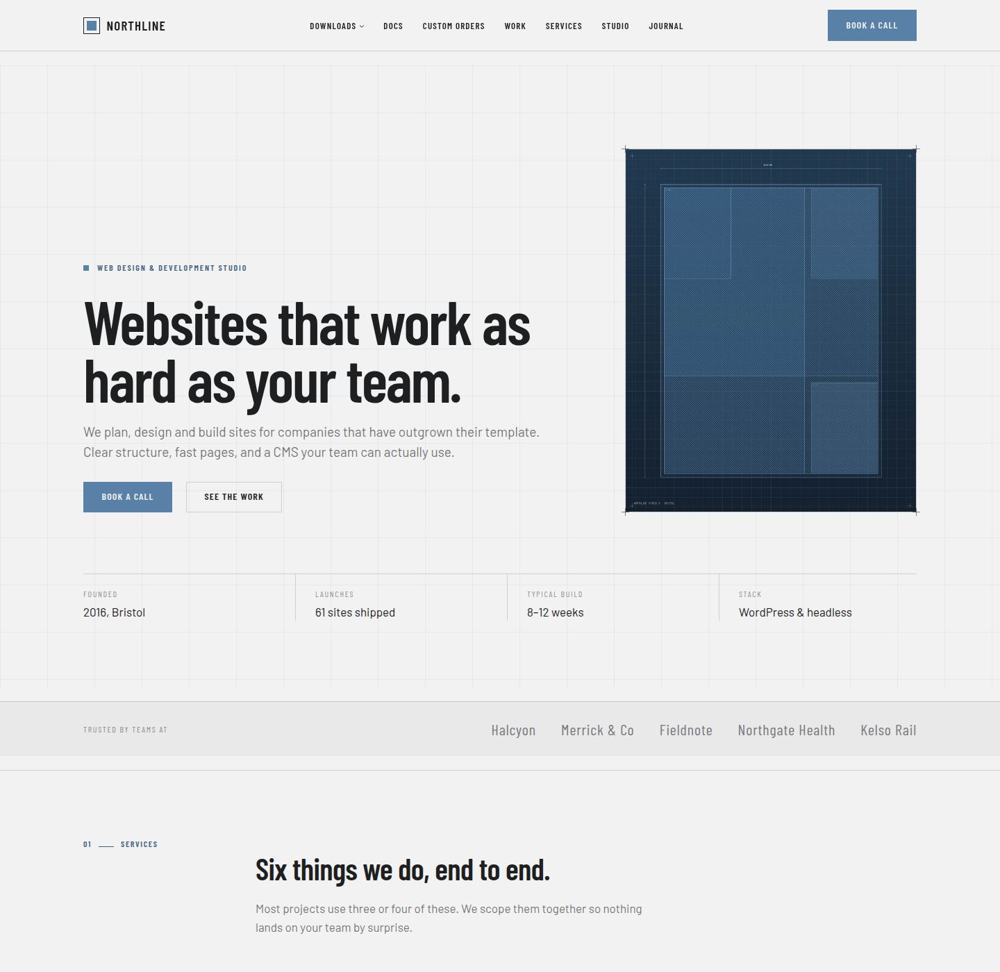

# Northline — a complete WordPress FSE block theme

A full-site-editing WordPress theme built from the *Web design agency WordPress theme*
design handoff, together with the entire demo site it was designed for: every page,
post, case study, catalogue entry, image and menu.

Install the theme, press one button, and you have the finished website.



---

## What is in the box

| | |
| --- | --- |
| **Theme** | `northline/` — a block theme, no build step, no dependencies |
| **Templates** | 18, covering pages, posts, case studies, the catalogue, taxonomies, search and 404 |
| **Template parts** | Header, footer, post meta |
| **Patterns** | 67 section patterns, grouped into six inserter categories |
| **Content types** | Projects (case studies) and Downloads (themes, plugins, scripts, tools) |
| **Blocks** | Two of our own: a catalogue meta line and a working enquiry form |
| **Fonts** | Barlow and Barlow Condensed, subset and bundled locally — no external requests |
| **Images** | 46, rendered from HTML by headless Chromium and shipped with the theme |
| **Demo content** | 13 pages, 8 journal posts, 9 case studies, 29 catalogue entries, 4 categories, menus |

Nothing here calls out to a third-party service. There is no page builder, no
framework, and no build tooling: the theme is the source.

---

## Installing

**From the admin.** Build the zip (below) or download it, then
*Appearance → Themes → Add New → Upload Theme*, activate, and follow the notice
to *Appearance → Northline setup*. Press **Import the demo site**.

**From the command line.**

```bash
wp theme install northline.zip --activate
wp northline demo import
```

The import is safe to run more than once — existing demo items are updated rather
than duplicated — and `wp northline demo remove` deletes exactly what it created
and nothing else.

Requires WordPress 6.5 and PHP 8.0.

---

## Building the zip

```bash
./tools/build.sh
# → dist/northline-1.0.0.zip
```

## Regenerating the images

Every image is drawn by a script rather than stored as an unexplained binary, so
the art direction is editable and the results are reproducible:

```bash
npm install                             # once, for Playwright
node tools/generate-images.mjs          # all 46
node tools/generate-images.mjs theme-   # only the files matching a fragment
```

Each plate is laid out in HTML and CSS and screenshotted by headless Chromium at
the exact size it is used. That is what puts real typography, gradients and
shadows in reach: the catalogue screenshots are rendered websites, the portraits
are drawn in SVG, and each journal cover is a diagram of the thing its article is
about. Nothing is downloaded and nothing is licensed from a stock library, so the
whole set ships under the theme's own licence.

Palette, scenes and the list of plates are all in that one file. Change a scene
and re-run with a name fragment to see it without rebuilding the set.

When the theme is updated, re-running the demo import replaces changed images in
the media library **in place**, keeping their attachment IDs — so featured images
and page content are never left pointing at the old artwork.

---

## How the site is put together

The point of the theme is that **every section on every page is a registered
pattern**. There is no hidden layer: what you edit in the Site Editor is what
built the demo site.

```
patterns/hero-home.php        →  the home page's opening section
patterns/services-grid.php    →  the six service cards
patterns/cta-*.php            →  the closing band, one per page's wording
```

The demo importer builds each page by concatenating pattern files:

```php
'services' => array(
    'patterns' => array( 'hero-services', 'services-accordion', 'handover-grid', 'cta-services' ),
),
```

So a page in the demo site and a page you build yourself from the inserter are the
same thing. Delete a section, reorder it, or rewrite its copy — it is ordinary core
blocks from the moment it lands.

### Design tokens

`theme.json` owns colour, type, spacing and layout. `style.css` owns only the
compositions theme.json cannot express — the blueprint frame, the numbered section
rail, the interactive components — and every value in it resolves back to a preset.

Change the accent in *Styles → Colours* and the whole site follows: cards, tags,
buttons, counters, the call-to-action band and the corner marks.

### Interactive components

Tabs, accordions, filters, the quote carousel, the price switch, the licence
picker, the count-up figures and the scroll reveals are one 400-line script with no
dependencies. They are found by class name, so the patterns stay ordinary core
blocks:

| Class | Component |
| --- | --- |
| `nl-tabs` / `nl-tab-btn` / `nl-tab-panel` | Tabbed panels, paired by document order |
| `nl-accordion` + `-head` / `-body` / `-mark` | Expanding row |
| `nl-filter-group` + `nl-filter-key-<term>` | Filters a query loop by the term classes WordPress already emits |
| `nl-carousel` + `-track` / `-prev` / `-next` / `-dot` | Quote carousel |
| `nl-switch` / `nl-choice` | Price term switch, licence picker |
| `nl-count-61`, `nl-count-9x4` | Counts up to the value in the class (`x` is the decimal point) |
| `nl-reveal` + `nl-delay-1…3` | Fade in on first scroll into view |

Everything degrades: with JavaScript off, panels render open, filters show the whole
set, and the figures print their final value.

### Forms

The contact, order and subscribe forms are handled entirely in WordPress —
server-side validation, a honeypot, a nonce, mail to the site address, and a private
`nl_enquiry` record so a mail failure never loses a lead. No third-party endpoint
and no account.

---

## Layout of the repository

```
northline/                 the theme
├── theme.json             tokens: colour, type, spacing, layout
├── style.css              component layer
├── functions.php          bootstrap
├── inc/
│   ├── setup.php          theme supports and assets
│   ├── post-types.php     Projects and Downloads
│   ├── blocks.php         block styles, pattern categories, dynamic blocks
│   ├── patterns.php       pattern loading
│   ├── template-tags.php  the helpers the patterns are written against
│   ├── forms.php          form markup, validation and delivery
│   └── demo/              media, content definitions, importer, WP-CLI
├── blocks/                meta-line, form
├── templates/             18 block templates
├── parts/                 header, footer, post meta
├── patterns/              67 section patterns
└── assets/                fonts, images, css, js
tools/
├── generate-images.mjs    renders every image in the theme
└── build.sh               produces the installable zip
```

## Licence

GPL v2 or later, matching WordPress. Barlow and Barlow Condensed are licensed under
the SIL Open Font Licence.
