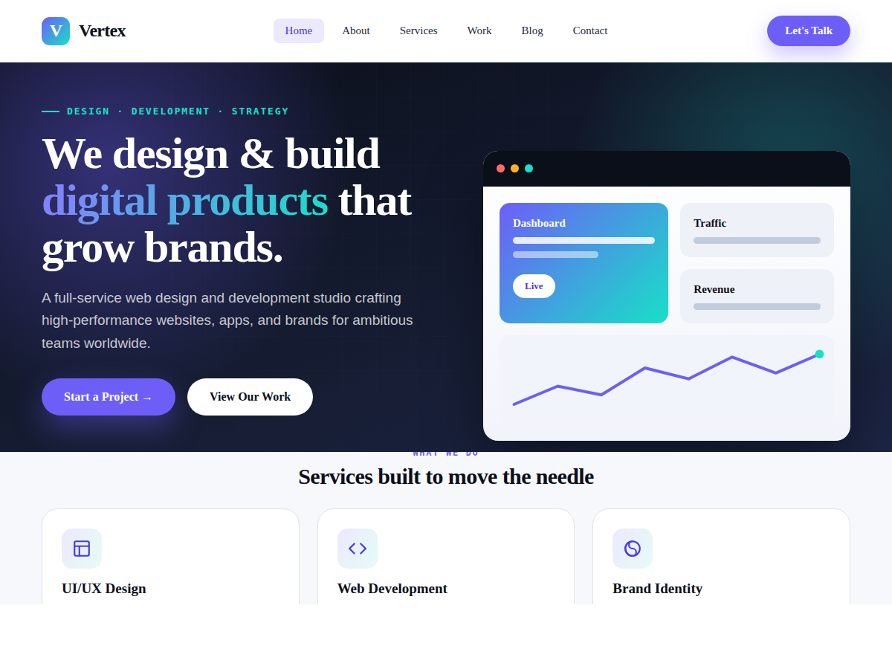

# Vertex — Premium WordPress Theme for Web Design & Development Agencies

Vertex is a professional, high-performance WordPress theme built for web design
and development studios, creative agencies, and freelance professionals. It ships
with a complete design system, one-click demo content, custom post types, dozens
of block patterns, and deep Customizer controls — so your site is fully populated
and ready to launch the moment you activate it.



---

## ✨ Highlights

- **Ready to use after install** — one click imports every page, post, project,
  service, team member, testimonial, category, and menu, then configures your
  homepage automatically.
- **Complete design system** — a cohesive palette, typography scale, spacing
  system, shadows, and components defined once in `style.css` and mirrored in
  `theme.json` for the block editor.
- **Custom post types** — Portfolio (Projects), Services, Team, and Testimonials,
  each with their own fields and templates.
- **Block patterns** — a full library of agency sections (hero, services, stats,
  testimonials, pricing, FAQ, CTA, feature split) plus complete page layouts,
  available in the editor under the **Vertex** category.
- **Powerful Customizer** — brand colors, fonts, layout width, header options,
  hero content, statistics, CTA, contact details, social links, and footer — all
  editable from the dashboard with live preview.
- **Self-contained imagery** — crisp, on-brand SVG illustrations and placeholders
  are generated by the theme, so it looks complete without uploading a single
  image (and every image is easily replaced with your own).
- **Fast & accessible** — semantic HTML5, keyboard-friendly navigation, reduced-
  motion support, lazy reveal animations, and Core Web Vitals in mind.
- **Developer friendly** — clean, documented, translation-ready code following
  WordPress coding standards.

---

## 🚀 Installation

1. In WordPress, go to **Appearance → Themes → Add New → Upload Theme**.
2. Upload the `vertex.zip` file (zip the `vertex` folder) and click **Install Now**.
3. Click **Activate**.
4. A welcome notice appears — click **Go to Vertex Setup** (or go to
   **Appearance → Vertex Setup**).
5. Click **Import Demo Content**. Done! Visit your site to see the fully built
   agency website.

> Requires WordPress 6.0+ and PHP 7.4+.

---

## 🧩 What the demo import creates

| Content | Details |
| --- | --- |
| **Pages** | Home, About, Services, Portfolio, Blog, Contact, Privacy Policy |
| **Portfolio** | 6 projects across 4 categories (Web Design, Branding, E-Commerce, App Design) with client/year/services metadata |
| **Services** | 6 services with icons (UI/UX, Web Dev, App Dev, Branding, SEO, E-Commerce) |
| **Team** | 4 team members with roles |
| **Testimonials** | 3 client testimonials |
| **Blog** | 6 posts across 5 categories with tags |
| **Menus** | Primary + Footer menus, created and assigned automatically |
| **Homepage** | Set to a static front page; blog set to the Blog page |

The import is safe to run once; it skips content that already exists.

---

## 🎨 Customizing

Everything is editable from **Appearance → Customize → Vertex Theme Options**:

- **Brand Colors** — primary, accent, and ink colors (with live preview).
- **Layout & Typography** — content width, Google Fonts toggle, blog layout.
- **Header** — announcement bar, search toggle, header button.
- **Homepage Hero** — headline, text, two buttons, optional hero image.
- **Statistics / CTA / Contact / Social / Footer** — all text and links.

Portfolio projects, services, team members, and testimonials are managed from
their own menu items in the dashboard sidebar.

### Using block patterns

Open any page or post in the block editor, click the **+** inserter, choose the
**Patterns** tab, and select the **Vertex** category to drop in ready-made
sections. Complete page layouts live under **Vertex Pages**.

---

## 🗂 Theme structure

```
vertex/
├── style.css                # Theme header + full design system
├── theme.json               # Block editor design tokens
├── functions.php            # Setup, enqueues, includes
├── front-page.php           # Smart homepage (patterns or coded sections)
├── header.php / footer.php
├── index.php / page.php / single.php / archive.php / search.php / 404.php
├── single-vx_work.php       # Portfolio project template
├── single-vx_service.php    # Service template
├── comments.php / sidebar.php
├── inc/
│   ├── template-tags.php     # Icons, SVG imagery, display helpers
│   ├── template-functions.php
│   ├── class-vertex-nav-walker.php
│   ├── custom-post-types.php # CPTs, taxonomies, meta boxes
│   ├── customizer.php        # All Customizer options
│   ├── block-patterns.php    # Pattern categories + block styles
│   └── demo-import.php       # One-click importer + setup screen
├── template-parts/          # Reusable parts + home/ sections
├── page-templates/          # Full-width, Portfolio, Contact templates
├── patterns/                # Block patterns
└── assets/                  # css / js / images
```

---

## 🌐 Translation

Vertex is translation-ready with the `vertex` text domain. A starter
`languages/vertex.pot` file is included.

---

## 📄 License

Vertex is licensed under the GNU General Public License v2 or later.
